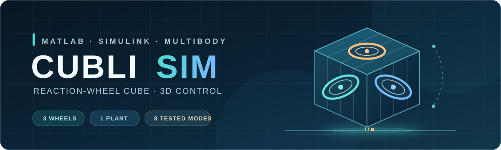
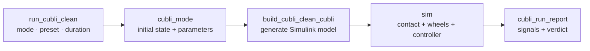

# Cubli Sim



**A code-generated, 3D reaction-wheel cube simulation built with MATLAB, Simulink, and Simscape Multibody.** The cube can balance on an edge or vertex, stand up from a flat face, and attempt a face-by-face walk. Its wheels, free body, and ground contact are simulated; motion is produced by the controller rather than a prerecorded animation.

**Language:** [English](README.md) · [简体中文](README.zh-CN.md)

**Start here:** [Quick start](#quick-start) · [Current capabilities](#what-works-today) · [How it works](#how-the-project-is-organized) · [Development records](#documentation)

> **Current status:** six of the eight baseline modes pass their simulation checks. Experimental low-speed presets now cover edge and vertex balance; string-directed walking completes tested routes but still has contact and route errors. Results apply to the documented simulation and solver settings, not hardware performance.

---

## Quick start

### 1. Requirements

- MATLAB **R2024b** (the version used for development and verification)
- **Simulink**, **Simscape**, and **Simscape Multibody**

Clone or download the repository:

```bash
git clone https://github.com/voyger4869/cubli-sim.git
cd cubli-sim
```

Set MATLAB's **Current Folder** to that repository root, where `setup_cubli.m` lives. **For a first, shorter run**, open [`src/core/run_cubli_clean.m`](src/core/run_cubli_clean.m) and set the mode, preset, and duration to:

```matlab
cubliMode    = "edge_balance";
cubliPreset  = "fast";
cubliSeconds = 10;
```

Now run in the MATLAB Command Window:

```matlab
setup_cubli
run_cubli_clean
```

The entry script calls `setup_cubli` itself, so the first command is optional when you run that script. It makes the path setup explicit and is needed before calling verification functions directly. The generated Simulink model opens, the script runs the simulation and prints a report, and signals such as `cubli_com`, `cubli_R`, `cubli_wx` / `cubli_wy` / `cubli_wz`, and `cubli_report` appear in the MATLAB workspace. Generated models and simulation artifacts are ignored by Git.

### 2. Choose an experiment

Edit the mode, preset, and duration and rerun `run_cubli_clean`. Route mode also uses `cubliRoute`:

| Goal | `cubliMode` | `cubliPreset` | `cubliSeconds` |
|---|---|---|---:|
| Inspect basic edge balance | `"edge_balance"` | `"fast"` | `10` |
| Stand from flat to edge, then keep wheel speed near zero | `"stand_to_edge"` | `"edge_near_zero"` | `300` |
| Balance on a vertex with low three-wheel speed (experimental) | `"point_balance"` | `"point_near_zero"` | `120` |
| Run flat → edge → vertex, then unload all three wheels | `"flat_to_point"` | `"point_near_zero"` | `120` |
| Run flat → vertex directly, then unload all three wheels (experimental) | `"flat_to_point_direct"` | `"point_near_zero"` | `60` |
| Try a four-step route (experimental) | `"walk_route"` | `"fast"` | `[]` |

For the route example, also set `cubliRoute = "RLUD"`; [route syntax and limits](#string-directed-walking) are below. `[]` uses the mode's own default duration. **Current duration override is mode-specific:** a nonempty `cubliSeconds` applies to `edge_balance`, `point_balance`, `edge_to_point`, `flat_to_point`, and `flat_to_point_direct`; for `stand_to_edge` it applies when the preset is `edge_low_speed` or `edge_near_zero`. Other modes keep their parameter-file duration. The entry script selects and checks the required contact-solver configuration for the wheel-speed presets.

To see **one built model** run multiple modes without regeneration between simulations, use `cubli_demo` after `setup_cubli`. In contrast, `run_cubli_clean` deliberately regenerates its model each time it is run; you do not need to build or edit the `.slx` manually.

## What works today

All capabilities use the same free-contact plant. “Passes” refers to the project's current simulation checks, not an unlimited-duration guarantee.

| Capability | Mode | Current status |
|---|---|---|
| Balance from an initial edge attitude | `edge_balance` | Passes the short-run check |
| Flat face → edge → balance | `stand_to_edge` | Passes |
| Balance from an initial vertex attitude | `point_balance` | Passes the 10 s check; separate low-speed presets are experimental |
| Edge → vertex | `edge_to_point` | Passes |
| **Flat face → edge → vertex → hold** | `flat_to_point` | Passes; complete two-stage stand-up |
| Flat face → vertex directly | `flat_to_point_direct` | Passes its current check; still experimental |
| Face-by-face walking | `walk` | Moves, but fails step-count/penetration checks |
| String-directed walking | `walk_route` | Fixed missed-step detection and wheel-speed overshoot; contact penetration and some long-route cross-track drift remain |
| Impulse-based flat → vertex | `stand_to_point` | Fails; wheel speed exceeds the budget |

`verify_cubli` checks the eight original modes with the verified `fast` preset; `walk_route` has its own verifier. **Six of the original eight pass; `walk` and `stand_to_point` are known failures.** See [status](docs/01_项目状态.md) and [failure analysis](docs/03_未解决与已证伪.md) for the exact limits.

### String-directed walking

In [`src/core/run_cubli_clean.m`](src/core/run_cubli_clean.m), use:

```matlab
cubliMode   = "walk_route";
cubliRoute  = "RLUD";       % one face roll per letter
cubliPreset = "fast";
```

Each letter requests one face roll in a fixed ground-plane world direction: `R/L` are `+X/-X`; `U/D` are `+Y/-Y`. Use `"RRRRRR"` for six consecutive rolls to the right. Routes contain 1–64 letters, case insensitive. The default duration is four seconds per letter plus two seconds; `cubliSeconds` does not override this mode.

The controller combines rotation, the new bottom face, and measured travel to confirm each step, then waits for wheel slowdown and a settled flat face. It reselects the wheel after a turn. `cubli_route_state` logs `[completed steps; phase; fault code]`; `cubli_report` checks each step, cross-track drift, endpoint, wheel speed, settling, and contact penetration. `verify_walk_route` runs five representative routes, including two that previously stalled. All 28 tested route combinations completed their requested steps below the 1800 rad/s wheel limit. **Contact penetration and cross-track drift on some longer routes still fail their checks.** See the [route development record](docs/08_字符串路线行走开发记录.md).

## Edge-balance wheel-speed presets

Select a preset with `cubliPreset` in the entry script. The figures below refer to the **Y wheel during edge balance** under each stated solver configuration. `edge_low_speed` and `edge_near_zero` are restricted to `edge_balance` and `stand_to_edge`.

| Preset | Observed behavior | Contact solver / scope |
|---|---|---|
| `fast` | Fast capture; Y wheel can climb to roughly 950 rad/s before leveling off | Original reference behavior |
| `wheel_stop` | Y wheel around 40–60 rad/s in recorded edge runs | 0.25 ms local step |
| `wheel_stop_yaw` | Adds gentle yaw control; X/Z wheels accumulate speed over time | 0.25 ms local step |
| `edge_low_speed` | Y wheel roughly 6–8 rad/s from 30–300 s after stand-up | Experimental; ODE5 @ 0.125 ms |
| `edge_near_zero` | At 300 s, final 30 s Y-wheel range **−0.73 to +1.73 rad/s**, mean **+0.56 rad/s**; stable edge capture in **2.278 s** | Experimental; ODE5 @ 0.125 ms |

The near-zero result is **not** a proof that the wheel converges exactly to zero: yaw and contact-position drift remain, and the numbers change when the contact-solver step changes. The measured improvement, failed trials, and solver comparison are in [the low-speed study](docs/06_棱平衡低轮速控制设计.md) and [development log](docs/07_近零轮速改进开发全过程.md).

### Vertex low-speed presets

`point_low_speed` and `point_near_zero` support **`point_balance`, `edge_to_point`, `flat_to_point`, and `flat_to_point_direct`**. The added wheel-speed feedback engages after vertex capture. For `flat_to_point`, the edge stage first unloads Wheel Y below 10 rad/s before handing over to the vertex controller. At ODE5 @ 0.125 ms, 30 s checks measured three-wheel tail maxima of **5.79 / 2.59 rad/s** for the two presets on `flat_to_point`; `edge_to_point` measured **5.84 / 2.51**, and `flat_to_point_direct` **5.43 / 2.33**. All three stand-up paths passed 120 s checks with `point_near_zero`. `point_balance` with a 3° initial roll measured **5.41 / 2.32 rad/s** at 60 s; the latter also held for 300 s. These are small nonzero residual speeds under a solver-sensitive contact model. `stand_to_point` remains an existing failed stand-up experiment. See the [vertex development record](docs/09_顶点低轮速控制实验.md).

## Verify a result

Run these from the repository root after `setup_cubli`:

```matlab
verify_cubli                                % eight modes; two known failures
verify_edge_low_speed("stand_to_edge",30)   % quick low-speed check
verify_edge_near_zero("stand_to_edge",300)  % long near-zero check
verify_edge_near_zero("edge_balance",120)   % starts on the edge
verify_walk_route                            % five route motion and wheel-speed trials
verify_point_speed("point_near_zero",120,3,0) % vertex, 3-degree initial roll
verify_point_speed("point_near_zero",60,0,0,"flat_to_point") % full stand-up and unloading
```

The near-zero verifier checks the solver block, continuous edge capture, edge-frame attitude, Y-wheel tail statistics, and the combined speed of **all three wheels**. The 300 s run is intentionally long. For controlled before/after comparisons of the original behavior, see `verify_preset_snapshot` and `verify_preset_compare` in [`src/verification/`](src/verification/).

## How the project is organized



| Path | Purpose |
|---|---|
| [`setup_cubli.m`](setup_cubli.m) | Adds the source folders to MATLAB's path |
| [`src/core/run_cubli_clean.m`](src/core/run_cubli_clean.m) | Main entry and experiment selection |
| [`src/core/cubli_clean_parameters.m`](src/core/cubli_clean_parameters.m) | Physical parameters, controller gains, mode defaults, and rationale |
| [`src/core/cubli_mode.m`](src/core/cubli_mode.m) | Derives the selected mode's initial state and stop time |
| [`src/core/build_cubli_clean_cubli.m`](src/core/build_cubli_clean_cubli.m) | Generates the single free-contact plant and controller |
| [`src/verification/`](src/verification/) | Acceptance and regression scripts |

The release contains the runnable plant and verification scripts. The larger development tree also contains experimental rigs and scripts cited by the historical documents; those are not all part of this release.

## Documentation

| Read | For |
|---|---|
| [01 · Project status](docs/01_项目状态.md) | Current capabilities and open problems |
| [02 · Test protocol](docs/02_测试协议.md) | Acceptance criteria and measurement evidence |
| [03 · Unresolved and falsified approaches](docs/03_未解决与已证伪.md) | Failures, corrections, and known pitfalls |
| [04 · Measurement record](docs/04_测量记录.md) | Recorded experiments |
| [05 · Architecture and development guide](docs/05_架构与开发指南.md) | Model construction, data flow, control logic, and development workflow |
| [06 · Edge low-speed study](docs/06_棱平衡低轮速控制设计.md) | Low-speed presets and solver sensitivity |
| [07 · Near-zero development log](docs/07_近零轮速改进开发全过程.md) | Full sequence of trials, setbacks, fixes, and release checks |
| [08 · String-directed walking](docs/08_字符串路线行走开发记录.md) | Route syntax, turning logic, measured results, and unresolved contact error |
| [09 · Vertex low-speed control](docs/09_顶点低轮速控制实验.md) | Three-wheel speed feedback, failed trials, solver sensitivity, and limits |

The contact model has **not demonstrated numerical convergence** across local solver steps. Long runs also show yaw and contact-position drift; wheel-speed improvements should always be read with those measurements and solver settings. This remains a simulation result, not a validated hardware controller.

## License

[MIT](LICENSE).
