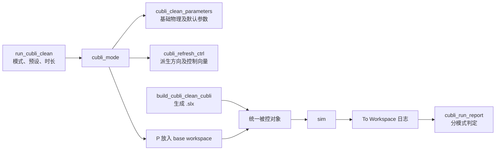

# Cubli 项目架构与开发指南

> 基线：GitHub 仓库 `voyger4869/cubli-sim` 的 `main`，提交 `d9e5a38`（2026-10-02）；完整开发树 `cubli_clean - 副本` 的共有核心文件与该提交逐文件相同。本文于 2026-10-03 根据源码和现有实验记录整理。文中的“通过”“失败”指**已有记录**，不表示编写本文时重新运行了 MATLAB 仿真。

> **后续实测更新：**同日新增了 [`06_棱平衡低轮速控制设计.md`](06_棱平衡低轮速控制设计.md)。
> 它记录了 `edge_low_speed` 在 ODE5 @ 0.125 ms 下 300 s 完整起立的结果，并更正了
> 下文将 `atan2(R13,R33)-45°` 称为长期“真实棱倾角”的表述：棱偏航后该固定轴量会
> 混入偏航。下文早期数值与推论是历史口径；新验收采用随棱坐标的倾角。
> **2026-10-05 接口与实验更新：**控制器已增加字符串路线和顶点低轮速的独立输入；
> 第 4.3、5.3 节据当前源码更新。顶点实验数值来自本轮 MATLAB 复测，详见
> [`09_顶点低轮速控制实验.md`](09_顶点低轮速控制实验.md)。

## 1. 项目要解决什么问题

Cubli 是装有三只反作用轮的方块。项目用 MATLAB R2024b、Simulink、Simscape 和 Simscape Multibody 建立三维仿真，让方块在地面的真实接触上完成以下动作：

1. 从平放姿态抬升到一条棱，并维持棱平衡；
2. 在顶点附近保持平衡；
3. 从棱继续抬升到顶点，组成“平放 → 棱 → 顶点 → 保持”的完整起立；
4. 探索平放直跳顶点和逐面行走。

主被控对象是**自由 6-DOF 刚体 + 罚函数接触 + 三只受力矩驱动的飞轮**。没有给主模型安装理想支撑铰链，也没有用预录动画代替起立。开发目录中的理想棱铰、顶点等台架用于辨识和控制律开发；发布版只保留统一主模型。

项目的成功标准不只是“动画看起来站住”。报告同时看姿态、高度、运行时长、力矩、穿透量；行走还看累积翻面数、位移和每步落平的时间比例。特别要区分**短时验收通过**与**长期稳定**：现有平衡会缓慢漂移，最终可能翻倒。

## 2. 阅读顺序与代码地图

发布版的入口在 `src/core/run_cubli_clean.m`。首次接手建议按下列顺序阅读：

| 文件 | 作用 |
| --- | --- |
| `README.md` | 对外介绍、运行方法及能力状态 |
| `docs/01_项目状态.md` | 阶段结论、关键参数和待办 |
| `docs/03_未解决与已证伪.md` | 未解决问题、失败路线与撤回记录 |
| `docs/02_测试协议.md` | 各能力的实验过程、判据和数字 |
| `docs/04_测量记录.md` | 由原始日志整理的测量表 |
| `src/core/cubli_clean_parameters.m` | 物理、控制、模式及验收参数的来源；包含大量实验依据 |
| `src/core/cubli_mode.m` | 将模式转换成模式码、初始条件、运行时长和最终控制参数 |
| `src/core/cubli_refresh_ctrl.m` | 根据预设与方向生成供控制块使用的 `P.run.ctrl` 向量 |
| `src/core/build_cubli_clean_cubli.m` | 编程搭建整台 Simulink/Simscape 模型及 MATLAB Function 控制块 |
| `src/core/cubli_run_report.m` | 按模式评价仿真结果 |
| `src/core/cubli_log_reshape.m` | 正确还原 `To Workspace` 时序数据形状 |
| `src/core/cubli_attitude_tilt.m` | 从姿态矩阵日志求身体固定方向的世界坐标 |
| `src/verification/` | 模式验收、行走方向验证、预设前后快照比较 |

完整开发树另有 `src/builders/` 中的 10 个旧台架 builder、`src/experiments/` 的 44 个实验脚本、`src/diagnostics/` 的 87 个诊断脚本，以及生成的图表镜像 `chart_as_m.m`。它们支持研究和溯源，并非发布版的运行依赖。发布版不提交生成的 `.slx`、`.slxc`、`slprj/` 和实验快照；忽略规则见 `.gitignore`。

## 3. 从启动到报告：一次仿真怎样跑起来

### 3.1 环境与入口

需要 MATLAB **R2024b**、Simulink、Simscape、Simscape Multibody。将 MATLAB 当前文件夹设为仓库根目录，然后运行：

```matlab
setup_cubli
run_cubli_clean
```

`setup_cubli` 把根目录和实际存在的 `src/core`、`src/verification` 等源码目录加入 MATLAB 路径。发布版的 `run_cubli_clean.m` 顶部设置 `cubliMode`、`cubliPreset`、`cubliSeconds`；出厂值分别是 `edge_balance`、`fast`、90 秒。`cubliSeconds=[]` 时使用模式自带时长。入口会自动调用 `setup_cubli`，手动运行一次主要是为了明确工作目录与路径。

### 3.2 数据流



实际调用顺序是：入口先通过 `cubli_mode` 生成 `P`，再调用 builder 生成模型，然后把 `P` 写到 base workspace 并运行 `sim`。`cubli_mode` 内部先取 `cubli_clean_parameters()` 的默认结构，应用可选覆盖，计算模式码、初始姿态/位置和时长，最后调用 `cubli_refresh_ctrl`。覆盖参数必须是 **N×2 cell**，每行是一个点分路径和一个值，例如：

```matlab
P = cubli_mode("point_balance", {"run.point.initialRollDeg", 2.0});
```

不要写成一行多对的 `{'a',1,'b',2}`：`cubli_mode` 按行循环，这种写法只应用第一对。改了 `P.run.edge.Kp` 等字段后，若直接复用 `P`，必须再运行 `P = cubli_refresh_ctrl(P)`，否则模型仍读旧的 `P.run.ctrl`。

### 3.3 “不重建模型”的准确含义

builder 在 `run_cubli_clean` 的**每次执行中都会生成** `Cubli_Clean_Cubli.slx`。README 所说的“切换模式无需重建”，指的是**已经建好的同一模型支持只换工作区的 `P` 再运行 `sim`**；`cubli_demo` 演示了这种用法。模型中的初始条件、模式码、停止时间、控制向量以及接触系数多数写成 `P.run.*` / `P.contact.*` 工作区表达式。

如果要用同一模型做多次对照，可以按下面的顺序操作；为 `wheel_stop` 类预设做实验时，还须在仿真前像入口脚本那样显式设置并回读接触局部步长：

```matlab
setup_cubli
model = build_cubli_clean_cubli();
P = cubli_mode("edge_balance", {"run.balancePreset", "fast"});
assignin("base", "P", P);
outFast = sim(model, "ReturnWorkspaceOutputs", "on");

P = cubli_mode("stand_to_edge", {"run.balancePreset", "fast"});
assignin("base", "P", P);
outStand = sim(model, "ReturnWorkspaceOutputs", "on");
```

接触局部求解器类型和步长不同：builder 在生成时把参数值写进 `Solver Configuration` 块；修改已建模型的 `P.sim.localSolver` 不会改变块设置。入口对 `wheel_stop` 和 `wheel_stop_yaw` 显式把步长设为 **0.25 ms**，并回读断言。默认 `fast` 使用参数文件中的接触设置 **ODE3 @ 1 ms**。Simulink 顶层配置另设 `ode23t`、最大步长 1 ms、相对容差 `1e-4`；不要把顶层求解器与机构局部求解器混为一谈。

### 3.4 输出

`sim` 的输出包括质心 `cubli_com`、世界系角速度 `cubli_rate`、姿态矩阵 `cubli_R`、接触穿透 `cubli_penetration`、三路命令力矩 `cubli_tau_x/y/z` 和三只轮速 `cubli_wx/wy/wz`。入口将它们放进 base workspace，打印 `cubli_run_report` 的结论、质心高度轨迹及三轮速度。`To Workspace` 的多分量数据常是 `n×1×N`；取第 `k` 分量应先用 `cubli_log_reshape(ts,n)` 得到 `n×N`，不能用 `reshape(Data,N,[])`。

## 4. 被控对象怎样搭建

### 4.1 物理网络

`build_cubli_clean_cubli` 调用 `new_system`，再用 `add_block` / `add_line` 编程连线，最后 `save_system`。主物理链是：

```text
World Frame → 6-DOF Free Body → Cube
World Frame → Ground Pose → Ground
Ground ↔ Spatial Contact Force ↔ Cube
Cube → 三个 Rigid Transform → 三个 Revolute Joint → 三只 Rotor
```

地面与方块的碰撞采用 `Spatial Contact Force`，法向为弹簧阻尼罚函数接触，切向使用 `SmoothStickSlip` 摩擦。三只飞轮的关节都打开力矩输入和速度测量。传感器测量质心世界坐标、世界坐标系角速度、3×3 姿态矩阵以及接触穿透，再经物理信号转换器进入控制块。控制输出经过三路 `Unit Delay`（2 ms 采样）和 `Simulink-PS Converter`，送到三个飞轮关节。

### 4.2 参数量级与几何

| 项目 | 当前值或关系 |
| --- | --- |
| 方块 | 0.50 kg，边长 0.150 m |
| 飞轮 | 3 × 0.08 kg，半径 0.050 m；装配体总质量 0.740 kg |
| 电机 | 连续力矩 0.30 N·m，峰值 0.80 N·m，轮速上限 1800 rad/s |
| 接触 | 法向刚度 `2.0e4 N/m`，阻尼 160，静/动摩擦系数 0.72/0.55 |
| 控制输出保持 | 2 ms |
| 质心高度 | 平放约 0.07464 m，棱约 0.10570 m，顶点约 0.12954 m |

三只轮心按参数文件中的 `wheelCenters` 排布，三项之和为零，避免一阶质量矩偏置。`cubli_mode` 的初值包含接触静压缩量 `m g / k`，避免把初始几何穿透误当作控制效果。平放、棱和顶点的质心高度不同，因此 `com_z` 是检查最终落点的重要独立信号。

### 4.3 控制块的接口与状态

builder 用 Stateflow 的 `EMChart.Script` 写入 MATLAB Function 控制器。九个输入依次是 `mode`、质心 `com`、世界系角速度 `omega`、姿态矩阵 `R`、三轮速度 `w`、原有 58 元素控制向量 `prm=P.run.ctrl`、仿真时钟 `clk`、字符串路线向量 `rprm=P.run.route.ctrl`、顶点低轮速参数 `pprm=P.run.pointSpeed.ctrl`；输出为 `tau=[tau_x;tau_y;tau_z]` 和路线状态。`P.run.modes` 的次序定义模式码：`idle=0`，棱平衡 `1`，平放到棱 `2`，顶点平衡 `3`，行走 `4`，冲量式平放到顶点 `5`，棱到顶点 `6`，完整两跳 `7`，直跳实验 `8`，字符串路线 `9`。新增模式时不能随意重排旧代码，因为历史测量按模式码引用。

控制器内部用 `persistent` 保存起立阶段、行走目标及积分状态。轮速积分和行走角度积分使用 `clk` 差值，负值截为零，单次增量的 `dt` 上限为 20 ms。控制图表不是一个纯粹每 2 ms 执行一次的离散控制器；2 ms `Unit Delay` 在其**输出路径**上。因此改动积分或求解器后，应检查其实际调用/复位行为。参数文件也记录过连续仿真调用时 `persistent` 可能未复位的疑点，绝对偏置数值需谨慎引用。

## 5. 各模式的控制逻辑

### 5.1 棱平衡 `edge_balance`（码 1）

初始方块放在棱平衡姿态附近，沿世界 Y 轴略偏 1°。控制使用 Wheel Y。当前默认反馈量是 `θ_com = asin(com_x / d)`，其中 `d=side/√2`；角速度是 `omega_y`。指令近似为

```text
τ_y = s · (Kp·θ_com + Kd·omega_y) + Kw·w_y + KiE·∫w_y dt + KiTilt·∫θ_com dt
```

其中默认 `Kp=2.2`、`Kd=0.15`、`Kw=2e-4`、`s=-1`；`fast` 预设的两个积分增益为零。输出被连续力矩上限裁剪；轮速守卫的**实际代码条件**是 `abs(w_i)>=wmax && tau_i*w_i>0` 时将该通道命令置零。控制器其他注释又使用 `ẇ=-τ/I_w` 描述轮速方向，因此下一轮排查超速问题时应以实测核对守卫符号，不能只按注释推断它一定阻止加速。`wheel_stop` 增加轮速积分 `KiE=3e-5`，`wheel_stop_yaw` 再用 X/Z 轮的反向力矩施加柔和偏航保持。

`θ_com` 有一个重要缺陷：质心平移也会改变 `com_x`，使它读出“假倾角”。旧报告另算固定轴姿态量 `θ_att = atan2(R13,R33)-45°`；**它仅在棱轴没有显著偏航时近似表示绕棱倾角**。旧预设的 `tiltOk` 仍按 `θ_com` 口径，保留历史基线；新 `edge_low_speed` 使用随棱坐标计算的倾角。改用固定轴姿态量做反馈的旧实验失败，不能只换反馈源就宣称修复。

### 5.2 平放到棱 `stand_to_edge`（码 2）

方块从平放且前侧底棱位于目标支点的初值开始。状态机先用 Wheel Y 储能：力矩 `-0.40 N·m`，低于平放重力翻倒门槛；轮速达到设定值（当前 900 rad/s）后反向急刹，峰值力矩 `+0.80 N·m` 越过门槛，使方块抬起。达到捕获角或轮速过零时，交给棱平衡律，并在交接后的短窗口允许峰值力矩捕获过冲。阶段切换基于轮速、角度和时钟，不靠动画时间点硬编码。

### 5.3 顶点平衡 `point_balance`（码 3）

在顶点姿态附近启动。顶点模式从姿态矩阵求身体对角线 `n=(1,1,1)/√3` 的世界方向 `u=R n`，取小角度误差 `[-u_y;u_x]`，结合 `omega_x/omega_y` 构造二维姿态 PD 和世界 Z 轴偏航阻尼。再通过实测的三轮到角加速度矩阵 `A`，以带阻尼的伪逆把目标运动量分配到三只轮：

```text
u_c = -KpP·[-u_y;u_x] - KdP·[omega_x;omega_y]
τ = signP · Aᵀ(AAᵀ + λ²I)⁻¹ · [u_c; -KyawP·omega_z]
```

当前 `KpP=820`、`KdP=30`、`KyawP=30`、`λ=0.08`。这里不能用 `asin(com_x/h)` 替代姿态：早期零摩擦点接触让水平质心坐标成为**死信号**，方块翻倒时它仍可能不变。当前顶点模式保留摩擦，才能与实际从平放起立的链一致。顶点平衡记录为 10 s 通过，捕获域约 20°；该范围依赖当前力矩配置与测试口径。

新增实验预设 `point_low_speed`、`point_near_zero` 支持 `point_balance`、`edge_to_point`、`flat_to_point` 和 `flat_to_point_direct`。其顶点轮速反馈为 `KwPoint·w`，增益分别为 `3e-5`、`7e-5 N·m·s/rad`，使用 ODE5 @ 0.125 ms；起立路径只在目标对角线接近竖直且水平角速度变小时逐渐接入。完整两跳还在棱阶段使用已有 `edge_near_zero` 的 Y 轮积分卸速，要求 `|wY|<10 rad/s` 才交接顶点律。原有预设的 `KwPoint=0`，原有顶点轮速积分 `KiPoint` 仍为零。完整两跳 30 s 验收两预设末段三轮合成转速分别约 5.79 与 2.59 rad/s；后者在 60 s 仍约 2.59。`point_balance` 的 3° 扰动及步长敏感性记录见 [`09_顶点低轮速控制实验.md`](09_顶点低轮速控制实验.md)。

### 5.4 棱到顶点与完整两跳（码 6、7）

从棱到顶点需要沿世界 X 轴侧向抬升约 35.26°。棱姿态下 Wheel X 和 Wheel Z 的世界 X 分量同向、世界 Z 分量相反，同号驱动可形成近似纯 X 力矩。有效默认方案把 `P.run.edgetopoint.spinSpeed` 设为 **0**，跳过“预储能—急刹”，让顶点控制律直接完成爬升。

这一路最终到达的身体对角线是 `(-1,1,1)/√3`，与单独顶点平衡的 `(1,1,1)/√3` 不同，误用会把正确到达姿态算作大倾角。轮轴随身体转动，固定使用顶点辨识矩阵会在爬升途中给出错误力矩方向。代码用当前姿态 `R`、顶点参考姿态 `R0` 和轮轴符号矩阵 `B` 修正为 `A_e(R)=A·(B R0ᵀ R B)`，再进行分配。

完整 `flat_to_point`（码 7）先完整复用平放到棱的储能、急刹、捕获阶段；只有棱角度与角速度都进入门槛，才交给顶点律。顶点捕获的峰值力矩门按**状态误差和角速度**决定，而非只按固定秒数关闭。现有记录显示这条完整起立通过，是项目当前最重要的完整能力。

### 5.5 两种平放直跳顶点（码 5、8）

`stand_to_point`（码 5）用 X/Y 两轮先储能、再急刹、最后交给顶点律。它仍保留作为失败实验，已有测试中轮速达到 **3129 rad/s**，超过 1800 rad/s 上限，验收未通过。`flat_to_point_direct`（码 8）从相同平放几何直接使用顶点律，不安排冲量阶段；已有重复结果，但增益可行范围窄，仍标为**实验**，没有升格为可靠能力。

### 5.6 逐面行走 `walk`（码 4）

`P.run.walk.dir` 可选 `+x/-x/+y/-y`。`cubli_refresh_ctrl` 将方向映射为驱动轮和符号：沿 X 行走由 Wheel Y 驱动、看世界 `omega_y`；沿 Y 行走由 Wheel X 驱动、看世界 `omega_x`。**旋转轴分量与质心位移轴分量不同**，测量时不得混用。

控制器对相应世界角速度积分得到**累积旋转角**，因为姿态角在 360° 后会折叠，不能计步。每一步依次为：驱动到约 88° 落面门槛、反向小力矩泄放飞轮、轮速低于门槛后将目标增加 90°。默认 8 步、驱动量 0.70。现有结果约完成 6.97 个面、位移 7.11 个边长，约 89% 时间落平；但步数和接触穿透验收不达标，改驱动量时结果跳变明显，因此**行走尚未通过**。

## 6. 如何判断实验是否真的成功

`cubli_run_report` 依据当前模式选择判据；所有模式先检查是否跑满 `P.run.duration`。核心判据如下：

| 模式族 | 主要检查 |
| --- | --- |
| 棱平衡 | 旧口径质心重建角 ≤ 5°、保持在棱高度、连续力矩、接触穿透 |
| 平放到棱 | 曾到达棱高度、最后 2 s 仍在棱上、角度、峰值力矩、穿透 |
| 顶点族 | 末态 `com_z>0.120 m` 且末段最低高度仍高于门槛、穿透 |
| 行走 | 角速度积分得到的面数、按方向计算的位移、落平时间比例、穿透 |

顶点高度门槛要位于棱与顶点高度**之间**；否则方块停在棱上也会被误判为顶点通过。行走计数要用累计量；`atan2` 的单圈角度不足以分辨多圈。轮速风险要同时检查 X/Y/Z 三路或三轮范数，不能只看 `w_y`。本报告的验收数值为短时、指定求解器配置下的结论，长期运行超过 5° 不应自动解释为新回归。

发布版提供以下验证入口：

```matlab
verify_cubli                    % 八个模式；walk 与 stand_to_point 是已知失败
verify_walk_directions          % 实测四向位移和对称性
verify_preset_snapshot("before")
% 修改代码后：
verify_preset_snapshot("after")
verify_preset_compare("before","after")  % 默认数值容差 0
```

这些脚本主要**打印**结果，尚无 GitHub Actions 自动验收。快照文件为本地 `.mat`，被 Git 忽略。`verify_preset_compare` 的零容差用于发现无意改变 `fast` 的结果；如果修改本来就会改变基线，需要记录新旧数值和原因，不能把“差异”一概当作错误。

## 7. 当前进度与证据边界

| 能力或问题 | 当前结论 | 边界 |
| --- | --- | --- |
| `stand_to_edge`、`edge_balance` | 短时验收通过 | 棱平衡长期漂移；`fast` 约数分钟后翻倒 |
| `point_balance` | 10 s 验收通过 | 当前接触、力矩、捕获范围内的结论 |
| `edge_to_point` | 通过，有重复测量 | 依赖姿态相关分配和当前模型参数 |
| `flat_to_point` | 通过，完整物理起立 | 已验收结果以 `fast` 预设为主 |
| `flat_to_point_direct` | 可重复的实验结果 | 参数区域窄，未升格 |
| `walk` | 能逐面行走 | 面数及穿透不达标，驱动参数下不稳健 |
| `stand_to_point` | 未通过 | 冲量式方案超飞轮转速预算 |
| `wheel_stop`、`wheel_stop_yaw` | 在棱平衡、0.25 ms 的记录中压低 Y 轮转速并改善寿命 | 数值尚未收敛；不能直接推广到完整起立链 |
| `edge_low_speed` | ODE5 @ 0.125 ms 下，完整起立后 300 s 的 Y 轮约 6–8 rad/s | 棱模式专用；接触漂移与步长敏感性仍在 |
| `edge_near_zero` | 同一求解器下，2.278 s 捕获；300 s 末 30 s 的 Y 轮 −0.73 到 +1.73 rad/s | 棱模式专用；偏航和接触漂移未消除，未证明数值收敛；见 `docs/06` |

这些结论的原始数字与撤回过程分别见 `docs/02_测试协议.md`、`docs/03_未解决与已证伪.md`、`docs/04_测量记录.md`。棱平衡低轮速与近零轮速的详细开发过程见 [`06_棱平衡低轮速控制设计.md`](06_棱平衡低轮速控制设计.md)和[`07_近零轮速改进开发全过程.md`](07_近零轮速改进开发全过程.md)。完整开发树中的实验脚本是追溯这些数字的工作材料，公开仓库没有全部收录。

## 8. 已知问题与开发教训

### 8.1 接触模型尚未数值收敛

同一 `wheel_stop` 配置把接触局部步长从 0.5 ms 改到 0.25 ms 时纹波显著减小，但再减到 **0.125 ms 却翻倒**。因此“0.25 ms 看起来很好”只是该步长的测量，不能声称已得到收敛解。任何接触相关数字都必须同时记录求解器类型、局部步长和模式；理想支撑 ODE1 @ 2 ms 与真实接触 ODE3 @ 1 ms 的历史数字不能直接比较。仅凭减小步长调出一个好结果不构成修复。

### 8.2 棱平衡长期漂移，控制状态含滑移

旧实验记录了 `fast` 约 4 分钟翻倒、`wheel_stop` 约 700–800 s 翻倒和 `wheel_stop_yaw` 超过 1200 s 的运行。它们用固定轴姿态角解释“先到极限的是倾角漂移”，而该角在偏航后并非随棱倾角，因此这一**成因解释需重验**；实际翻倒事件仍由质心高度确认。`com_x` 还会长期变化；用它重建的“倾角”混入平移。接触力分布不对称只是待检验假设。最新低轮速数据和测量口径见 `docs/06`。

### 8.3 偏航与飞轮动量

已有实验把偏航偏置与接触摩擦关联起来；增大摩擦反而加重偏置。`wheel_stop_yaw` 用 X/Z 轮减缓自转，代价是这两只轮的速度随运行时间近似线性增长。持续外扰不能靠有限轮速无限期吸收。部分实验给出的偏置**绝对量级**有相互矛盾的读数，参数文件也注明了这点；定量复用前需重新核对仿真状态和控制块复位。

### 8.4 曾导致错误结论的测量陷阱

- `reshape(Data,N,[])` 把 `n×1×N` 的多分量日志交错，曾制造不存在的 COM 循环和接触颤振。
- 只读 Y 轮曾把动量转移到 X/Z 轮误报为“飞轮已停”。
- 未确认建模时读入的局部步长已经改变，曾让多组实验逐位相同。
- 用一个不能区分平放、棱、顶点的高度门槛，或用在运动中不变化的死信号做判据，都能产生外观正常的假通过。
- 覆盖参数必须逐项回读；更改派生字段的源参数后须重新生成 `P.run.ctrl`。

## 9. 下一阶段建议的开发顺序

1. **先建立可相信的长期基线。** 在发布版固定提交上保存 `fast` 短时模式快照，记录长时棱平衡的姿态倾角、质心滑移、三轮速度、接触力与求解器档位。把测量量与控制量明确分开。
2. **定位倾角漂移和接触数值问题。** 设计能区分接触力分布、真实姿态慢模态、控制器积分/复位以及求解误差的对照实验。对关键结论做步长或求解器敏感性检查；不要把单一步长的优化直接并入默认预设。
3. **重新定义长期验收口径。** 保留既有 `fast` 短时指标用于回归；另设真实姿态、滑移、三轮范数、长期保持时间等新指标，明确是否需要迁移全部历史数据。
4. **在棱平衡问题厘清后验证预设跨模式使用。** 特别测试 `wheel_stop` / `wheel_stop_yaw` 对 `stand_to_edge`、`flat_to_point` 的起立阶段是否产生副作用，而不是直接沿用棱平衡结论。
5. **随后处理直跳和行走。** 冲量式顶点起立要先解决轮速预算；行走要以面数、位移、穿透和驱动参数邻域的稳健性一起验收。行走在现有记录中优先级较低。

每个新实验建议写明：基线提交、模式、预设、全部覆盖参数及其回读值、ODE 与局部步长、终止时间、三轮轨迹、真实姿态和质心轨迹、接触穿透、判据与原始结果。失败的尝试也保留，这个项目已经多次从失败对照中找到真正的误测或误控原因。

扩展新模式时，按实际依赖顺序修改：先在 `cubli_clean_parameters` 追加模式名及参数（保持旧模式码）；再在 `cubli_mode` 配置初始姿态和时长；需要新控制参数时同步修改 `cubli_refresh_ctrl` 的向量及 builder 中 MATLAB Function 对该向量的索引和分支；最后给 `cubli_run_report` 加能区分成功与失败的判据，并在 `src/verification` 添加对应运行场景。先用短时反例检查判据会不会把平放或错误顶点误判为成功，再用现有快照检查无意回归。builder 的图表代码以字符串生成，修改后必须实际构建一次，静态文本检查不能代替图表编译。

## 10. 从开发树到 GitHub 发布版

完整开发目录用来做台架、扫描和诊断；`GitHub/` 是公开发布版。当前两者共有的核心实现相同，因此后续改动应以发布版 `main` 的 `d9e5a38` 为起始对照，明确哪些是实验代码、哪些是运行必需代码。发布时同步必要的 `src/core` 改动、可复验的 `src/verification` 检查以及 `docs/01`～`04` 中改变的结论，并更新本文与 README。无需把全部内部扫参脚本或生成的 `.slx` 搬进公开仓库。

发布前至少确认：入口能生成并运行模型；原有已通过模式没有无意退化；已知失败仍如实标记；`fast` 快照差异被解释；新的数字注明求解器配置；文档中不把实验结果写成已验收能力。GitHub 仓库目前没有 CI，验证需要在 MATLAB R2024b 环境中实际执行并保存结果。本文是理解和交接指南，最终实验结论以对应的测量记录与代码提交为准。
